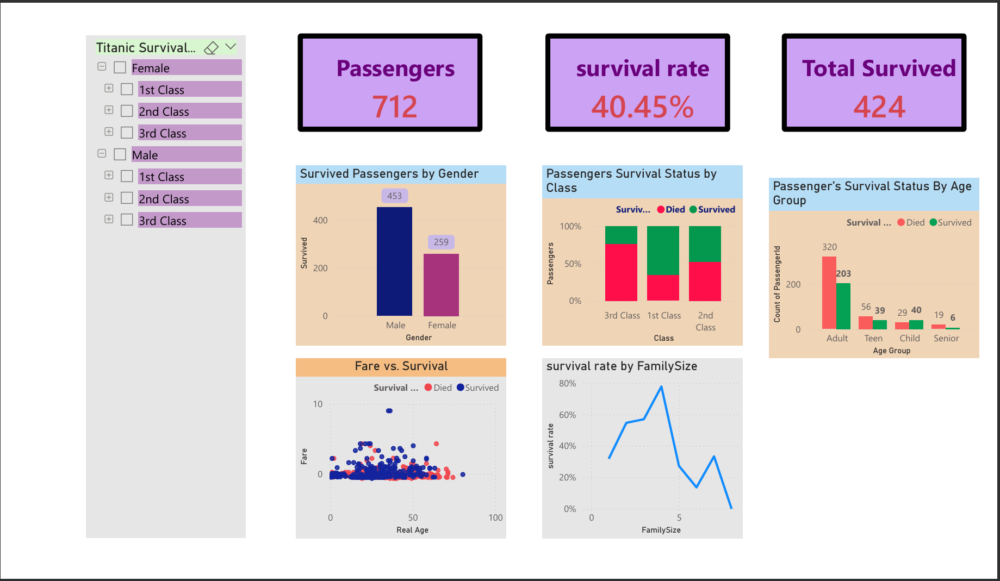
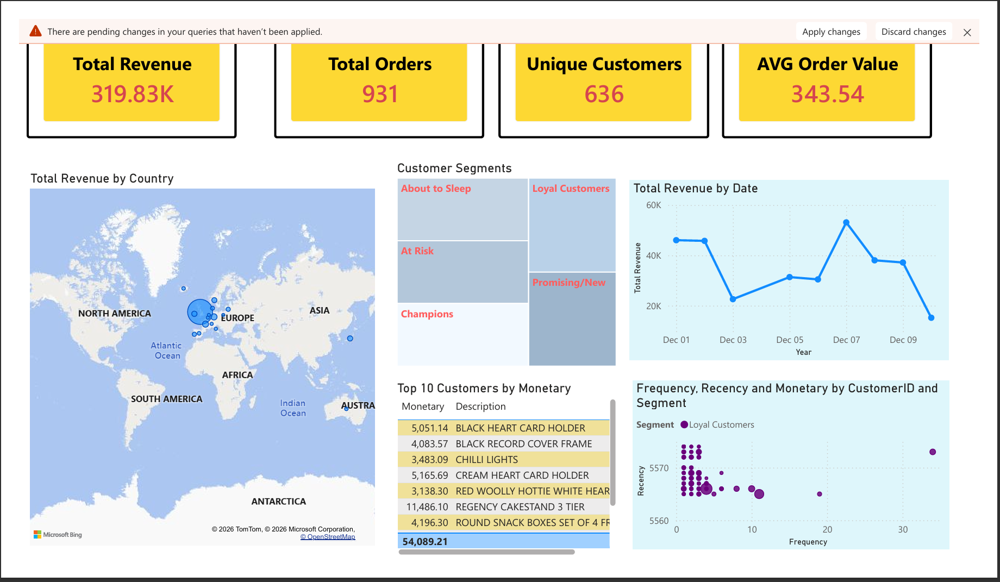
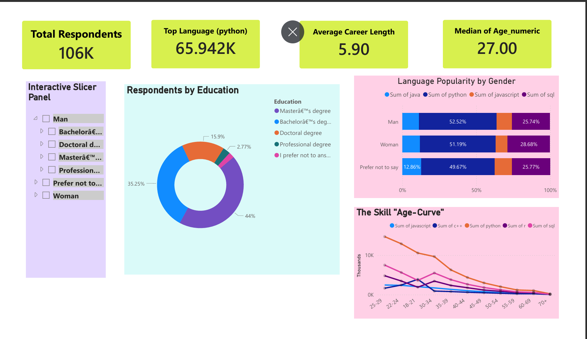

<h1 align="center">📊 Elevvo Data Analytics Internship Projects</h1>

<b>Data Analytics projects completed during the Elevvo Data Analytics Internship</b>
 
Demonstrating practical experience in data analysis, visualization, SQL analytics, and business insight generation.

<b>Author:</b> Muhammad Haseeb  
BS Computer Systems Engineering — UET Peshawar

<h2>📌 About This Repository</h2>

This repository contains four data analytics projects completed during the Elevvo Internship.
These projects cover the complete analytics workflow including:

<ul>
<li>Data Cleaning</li>
<li>Exploratory Data Analysis (EDA)</li>
<li>Data Visualization</li>
<li>Customer Segmentation</li>
<li>SQL Data Analysis</li>
<li>Business Insight Generation</li>
</ul>

<h2>🧰 Tools & Technologies</h2>

<ul>
<li>Python</li>
<li>Pandas</li>
<li>NumPy</li>
<li>Matplotlib</li>
<li>Seaborn</li>
<li>SQL</li>
<li>Kaggle Notebooks</li>
<li>Git & GitHub</li>
</ul>

<h2>🚢 Task 1 — Titanic Survival Data Analytics</h2>

This project explores the Titanic dataset to understand which factors influenced passenger survival.
The analysis focuses on variables such as passenger class, gender, age, and fare.

<h3>Key Analysis</h3>

<ul>
<li>Data cleaning and preprocessing</li>
<li>Exploratory Data Analysis</li>
<li>Survival distribution analysis</li>
<li>Visualization of key factors affecting survival</li>
</ul>

<h3>📸 Project Screenshots</h3>

<b>Kaggle Notebook:</b> 
<a href="https://www.kaggle.com/code/haseebzai30/titanic-survival-data-analytics">
Titanic Survival Data Analytics
</a>

<h2>📊 Task 2 — RFM Analysis for Customer Segmentation</h2>

This project performs customer segmentation using the RFM (Recency, Frequency, Monetary) model.
The goal is to identify high-value customers and understand purchasing behavior.

<h3>Key Analysis</h3>

<ul>
<li>Calculation of Recency, Frequency, and Monetary values</li>
<li>Customer segmentation</li>
<li>Identification of loyal and high-value customers</li>
<li>Customer behavior analysis</li>
</ul>

<h3>📸 Project Screenshots</h3>

<b>Kaggle Notebook:</b> 
<a href="https://www.kaggle.com/code/haseebzai30/rfm-analysis">
RFM Analysis
</a>

<h2>📊 Task 3 — Data Cleaning & Insight Generation from Survey Data</h2>

This project focuses on cleaning and analyzing survey data to generate meaningful insights.
Survey datasets often contain missing values and inconsistencies that must be handled before analysis.

<h3>Key Steps</h3>

<ul>
<li>Handling missing values</li>
<li>Removing duplicates</li>
<li>Data transformation</li>
<li>Exploratory analysis</li>
<li>Insight generation</li>
</ul>

<h3>📸 Project Screenshots</h3>

<b>Kaggle Notebook:</b> 
<a href="https://www.kaggle.com/code/haseebzai30/data-cleaning-and-insight-generation-from-survey-d">
Data Cleaning and Insight Generation from Survey Data
</a>

<h2>📊 Task 4 — SQL-Based Analysis of Product Sales</h2>

This project analyzes product sales data using SQL queries to extract meaningful business insights.
SQL is used to calculate sales metrics and identify top-performing products.

<h3>Key SQL Analysis</h3>

<ul>
<li>Total revenue calculation</li>
<li>Top-performing products</li>
<li>Sales distribution analysis</li>
<li>Product demand patterns</li>
</ul>

<h3>📸 Project Screenshots</h3>

<b>Kaggle Notebook:</b> 
<a href="https://www.kaggle.com/code/haseebzai30/sql-based-analysis-of-product-sales">
SQL-Based Analysis of Product Sales
</a>

<h2>🚀 Skills Demonstrated</h2>

<ul>
<li>Data Cleaning and Preprocessing</li>
<li>Exploratory Data Analysis</li>
<li>Data Visualization</li>
<li>SQL Data Analysis</li>
<li>Customer Segmentation</li>
<li>Business Insight Generation</li>
</ul>

<h2>👨‍💻 Author</h2>

<b>Muhammad Haseeb</b> 
BS Computer Systems Engineering 
University of Engineering & Technology Peshawar

GitHub: 
<a href="https://github.com/Haseeb-zai30">
https://github.com/Haseeb-zai30
</a>

⭐ If you find this repository helpful, consider giving it a star.

